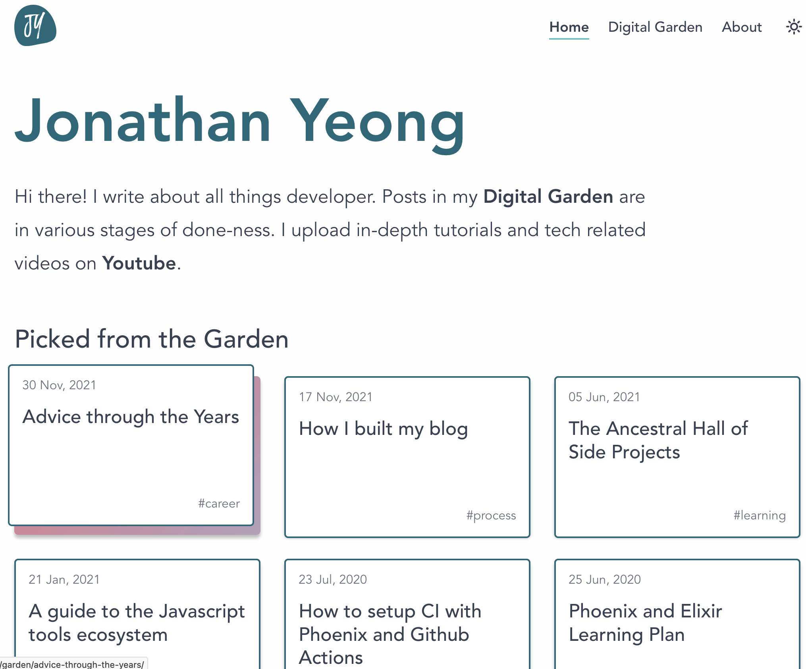

If you've been here before you might have noticed a few things have changed. That's right, I blew up my blog and rebuilt it from ground up! Two years ago I wrote this line in a [previous blog redesign post](/blog-redesign-2021):

> I heard of this new Static site generator, Astro that looks very interesting…
> Nope. Not going down that path.

Well my friend, I moved from [SvelteKit](https://kit.svelte.dev/) to [Astro](https://astro.build/) 😅. On top of a framework change, I also changed my design to embrace minimalism. I wanted to focus on content and nothing else, being heaviy inspired by [Irrational Exuberance](https://lethain.com/). In my previous site, I fell into the trap of spending my energy building features that weren't the core reason of why someone would come to my site. With the stage set, let's talk through some of my thoughts so far on the rewrite:

### Moving fast with Astro & Tailwind
Getting up and running with Astro was a really nice experience. For the first time, I feel like I have a static site generator that is straightforward to use. But offers the additional flexibility to add more reactive features using [Astro islands](https://docs.astro.build/en/concepts/islands/). No shade to SvelteKit though! I loved it but I felt like it was too much for my needs. I'm trying to embrace minimalism in all aspects, including framework features.

Another thing that Astro gives is typing on my Markdown frontmatter. I love this feature! It means that I can have build time errors if I have a typo or if I'm missing a frontmatter key. You can read more about [defining collection schemas on the Astro docs](https://docs.astro.build/en/guides/content-collections/#defining-a-collection-schema).

I also moved to [Tailwind](https://tailwindcss.com/) for this rewrite and deleted most of my CSS in the process. Tailwind is a utility first CSS framework that allows you to style an element through class names. For example, here's how my links are styled:

```html
<a href="" class="no-underline font-semibold dark:text-teal-400 text-logo-green before:bg-teal-600 before:dark:bg-teal-300 before:rounded-lg hover:before:opacity-100 hover:dark:text-teal-300 hover:text-teal-600 relative">
  Link
</a>
```

Honestly, the upside of not having to maintain my css far outweighs the downside of poor readibility on elements with lots of classes. Getting Astro setup with Tailwind was a breeze with the `@astrojs/tailwind` [integration](https://docs.astro.build/en/guides/integrations-guide/tailwind/).

### Changing URL namespacing
I moved away from the `/garden/<blog-title>` hierarchy and flattened it to `/<blog-title>`. Swyx writes:

> Personal sites of frequent speakers often opt for TWO namespaces: /writing and /speaking. My current site (as of Sept 2020) uses this, but I have grown to dislike it: I will often speak about what I write, and write about related things I speak about. Why separate them? It is more effort to make my talks discoverable to my readers and vice versa.

In his article [*Against Namespacing Personal Sites*](https://www.swyx.io/namespacing-sites). And while I agree with this idea, I tried to overcome that by having a `garden/` namespace. But I'll admit, the naming is horrible. If you don't know what a [digital garden](https://maggieappleton.com/garden-history) is then a `garden/` namespace makes no sense. You can set this up in Astro by adding a `[...slug].astro` file at the root of `src/pages` folder.

### Generating OpenGraph (OG) Images on the fly
Honestly, this is my favourite part of the redesign. I'm using [Netlify Edge functions](https://docs.netlify.com/edge-functions/overview/) to generate OG images on the fly. This image will show up when you share this post on Twitter (or Facebook but who still uses that). Shoutout to Kevin Zuniga Cuellar, whoe wrote about [og images on the edge](https://www.kevinzunigacuellar.com/blog/og-images-on-the-edge/). The annoying parts of building this were:
- Debugging was painful because there wasn't great error messages when something broke. And every change took a second of build time so the feedback loop was pretty longer then I wanted.
- You can't access folders with Netlify Edge functions which meant that I can't use custom fonts unless they're loaded on some CDN.

---

I'm trying to get better at building in public so this site is far from finished. I want to focus on content next. Over time, I'll be adding pages for tags, featured and an about page. If you're curious, here's a screenshot of the old homepage and you can still play with the old site [here](https://elastic-engelbart-26e6d9.netlify.app/).

